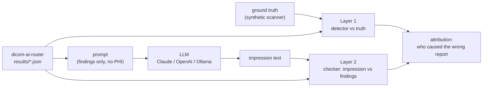

# llm-eval-radiology

[](https://github.com/seth2177/llm-eval-radiology/actions/workflows/ci.yml) [](https://pypi.org/project/llm-eval-radiology/)

**When an AI-drafted radiology report is wrong, was it the detector or the language model?**

Imaging AI is moving from "a box on the key image" to "a drafted report." That adds a second model to the chain,
and a second way to be wrong. This project scores both layers against ground truth and attributes each bad
report to the layer that caused it.



It reads the output of [dicom-ai-router](https://github.com/seth2177/dicom-ai-router) directly. Every study the
router processed has `results/<uid>.json` (what the detector said) and `truth/<uid>.json` (what was really
placed in the image).

## Run it

Requires Python 3.11+.

```bash
git clone https://github.com/seth2177/llm-eval-radiology && cd llm-eval-radiology
python -m pip install -r requirements.txt

python -m llm_eval selftest --data examples/router-150                  # prove the checker first
python -m llm_eval run --data examples/router-150 --model scripted --out out/scripted
```

Or install it from PyPI and run the same thing from any folder. The 150 example studies ship inside the
package, and `--data` defaults to them:

```bash
pip install llm-eval-radiology
llm-eval-radiology selftest
llm-eval-radiology run --model scripted --out out/scripted
```

Then with a real model (your key, your spend; `--limit` caps it):

```bash
export ANTHROPIC_API_KEY=...        # PowerShell: $env:ANTHROPIC_API_KEY = "..."
python -m llm_eval run --data examples/router-150 --model anthropic --out out/claude --limit 40

export OPENAI_API_KEY=...
python -m llm_eval run --data examples/router-150 --model openai --model-name <model id> --out out/openai

python -m llm_eval run --data examples/router-150 --model ollama --model-name <name from `ollama list`> --out out/local
```

Each run writes `report.md` (the readable summary), `metrics.json` and `cases.jsonl` (every impression with its
verdict, for review). Point `--data` at any dicom-ai-router workdir to score a fresh run.

## What it measures

**Layer 1, detector vs ground truth.** Sensitivity and specificity with 95% Wilson intervals, sensitivity by
density and Fleischner size band, wrong-side detections, and size error on true positives.

**Layer 2, impression vs detector findings.** Does the report say what the detector said, and only that?

| Error | Meaning |
|---|---|
| `HALLUCINATION` | a nodule in the report that the detector never reported |
| `OMISSION` | a detector finding missing from the report |
| `LATERALITY` | right and left swapped |
| `SIZE` / `SIZE_MISSING` | size off by more than rounding (0.5 mm), or not given |
| `FOLLOWUP_WRONG` / `FOLLOWUP_MISSING` | recommendation doesn't match Fleischner 2017 for the detector's size (the multiple-nodule table when it reported more than one), or is absent |
| `FOLLOWUP_UNWARRANTED` | imaging follow-up recommended when there is no nodule |
| `UNPARSEABLE` | the checker can't tell what the report says, so a human reviews it |
| `OUT_OF_SCOPE` | the detector reported more than six nodules (not scored) |

**Attribution.** Crossing the two layers. The detector counts as right only when it found the nodule on the
correct side at a size that keeps the patient in the correct Fleischner category (or correctly found nothing):

| | LLM faithful | LLM unfaithful |
|---|---|---|
| **Detector right** | report right | LLM error |
| **Detector wrong** | detector error | both wrong |

The detector-error cell is the one that matters most in practice. A perfectly faithful LLM still produces a
wrong report when the detector misses. No amount of prompt work fixes that; only the detector, or a human, can.

## Why trust the checker

The checker is rule-based and deterministic, so every verdict traces to a line of code. It's tested three ways:

1. **Planted errors.** A scripted "LLM" writes correct impressions in varied phrasing (including same-sentence
   negations like "no additional nodules" and negated alternatives like "PET/CT is not needed"), then plants
   exactly one known mistake per report, including size errors just past the 0.5 mm tolerance. `selftest`
   plants one in every report, then none, across three seeds. The checker has to find exactly what was
   planted, with no false alarms, or CI fails. The router data never has two detector findings on one study,
   so `selftest` also runs 57 multi-nodule variants of it, where the planted mistakes include the
   single-nodule recommendation applied to several nodules.
2. **Real-world phrasing.** `tests/test_checker.py` holds impressions written the way radiologists and LLMs
   write them: `0.6 cm`, `6 by 7 mm`, `6,3 mm`, `RUL`, `6-12mo`, `six to twelve months`, numbered lists,
   "lungs are clear without pulmonary nodules."
3. **Adversarial review.** Two separate review rounds wrote about 210 impressions aimed at breaking it. The ones
   that got through are now regression tests: a hallucinated nodule hidden in a sentence that also says "no other
   nodules," a recommendation that was negated ("PET/CT is not indicated"), a size that belonged to a lymph
   node or a slice thickness, a follow-up interval outside the guideline, "18-24 months" without the 6-12 month
   scan before it, and a thyroid nodule written up as if it were in the lung.

When a report is ambiguous (two sides or two sizes in one sentence, "less than 6 mm," "stable" or "previously"
with no prior study to compare against, or several nodules that can be matched to the detector's findings in
two ways with different errors) the checker returns `UNPARSEABLE` for human review instead of guessing.
That is a design rule, not a proof: a phrasing nobody has tested yet can still fool it, which is why every
impression is kept in `cases.jsonl` for review.

## Sample run

150 studies from dicom-ai-router (`examples/router-150`, synthetic): 14 head CTs never left the router, 28 QA
phantoms went to the QA model, and 108 chest CTs were scored. The scripted model had a 30% planted-error rate:

| Outcome | Reports |
|---|---|
| report right | 51 |
| LLM error (detector was right) | 21 |
| detector error (LLM was faithful) | 24 |
| both wrong | 12 |

The checker matched the planted errors exactly on 108 of 108 reports. The detector side shows what the mock
detector was built to show: it finds every solid nodule of 6 mm or more, half of those under 6 mm, and no
ground-glass nodules at all. It also measures 5 mm nodules as 6.3 mm, which is the right side but moves the
patient from "no routine follow-up" to "CT in 6-12 months." Attribution counts that as a detector error.

So 36 of the 57 wrong reports trace to the detector, and those 36 would have been wrong with a perfect LLM.

These numbers describe the harness, not any vendor's model. Run it against Claude, GPT or a local model for
real ones.

## Design choices

- **Only de-identified finding fields go to the LLM**: side, size and confidence. No UIDs, names, dates or
  accession numbers, so a hosted model needs no PHI. A test enforces it.
- **Plain httpx adapters**, no vendor SDKs. Each accepts a mock transport, so the exact request shape is tested
  without the network. Request errors (4xx) fail at once; timeouts, rate limits and server errors (408, 429,
  5xx) back off and retry. One failed case is recorded as `MODEL_ERROR` and the run carries on, and every
  result is written to `cases.jsonl` as it lands, so an interrupted paid run keeps what it finished.
- **A versioned prompt** (`PROMPT_VERSION`) and the temperature are recorded with every run. Temperature is 0
  for Claude and Ollama. For OpenAI it is left at the default unless `LLM_EVAL_OPENAI_TEMPERATURE` is set,
  because reasoning models reject any other value.
- **Fleischner 2017 in code** (`fleischner.py`), including the round-to-nearest-mm rule, with boundary tests.

## Limits

- One nodule type (pulmonary nodule) and English impressions. The checker reads side, size and follow-up. It
  doesn't read lobe (beyond mapping RUL/LLL etc. to a side), morphology, or comparison with priors; comparison
  language is flagged for review.
- Multiple nodules are scored with Fleischner's multiple solid-nodule table, by the largest nodule. The
  multiple subsolid table isn't implemented (the detector reports no density). Which sentence describes which
  nodule is decided by a written-down rule (size first, then side; see `docs/METHOD.md`), and the multi-nodule
  self-test runs on synthetic variants, because the router data never has two detector findings on one study.
  More than six findings on one study are `OUT_OF_SCOPE`.
- Fleischner 2017 applies to incidental nodules in low-risk adults 35 and over. It does not cover screening
  (Lung-RADS), younger patients, known cancer or immunosuppression.
- The data is synthetic. Real reports carry history, comparisons and hedging that this checker doesn't try to
  score.
- This is an evaluation tool, not a medical device, and nothing here is clinical advice.

## Layout

```
llm_eval/cases.py        load router results + ground truth
llm_eval/detector.py     layer 1 metrics, Wilson intervals
llm_eval/prompt.py       the impression prompt (versioned)
llm_eval/models/         anthropic, openai, ollama adapters + the scripted model
llm_eval/checker.py      layer 2: read the impression, compare with the findings
llm_eval/fleischner.py   follow-up categories (single and multiple nodules)
llm_eval/synthetic.py    multi-nodule variants for the checker self-test
llm_eval/run.py          evaluation, attribution, checker meta-evaluation
examples/router-150/     150 synthetic studies from dicom-ai-router
docs/METHOD.md           definitions, and how each number is computed
```

---

Built by **Seth Turnbo**: 23 years on MRI/CT (GE, Philips, Siemens), multi-vendor DICOM/HL7/PACS integration. [LinkedIn](https://www.linkedin.com/in/sethturnbo)
